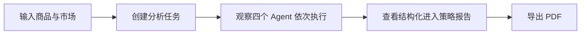
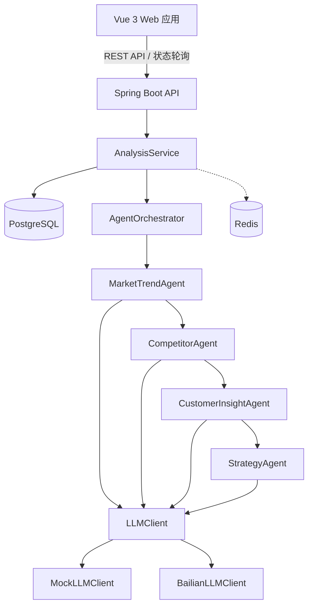
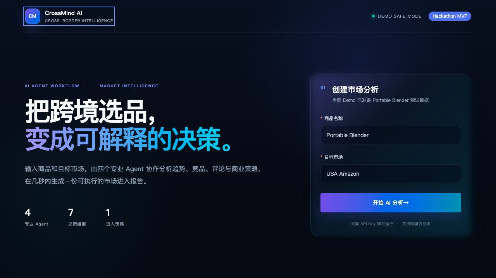
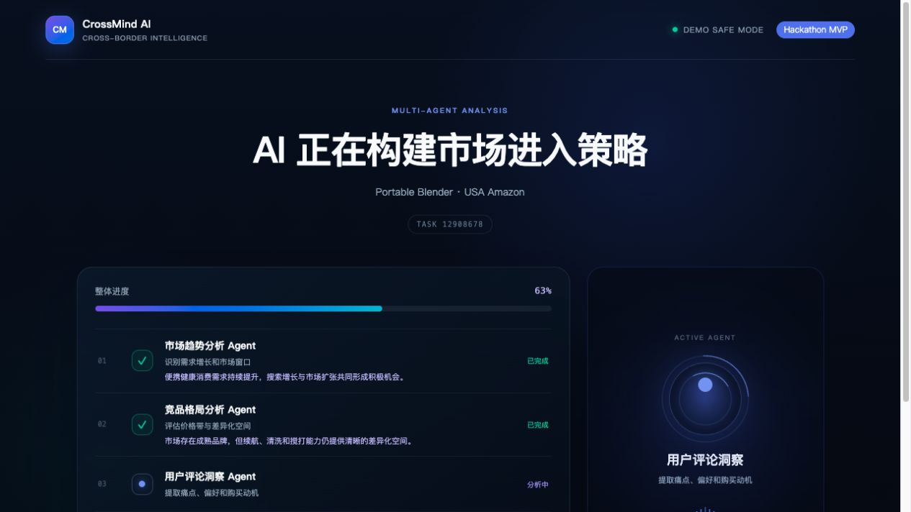
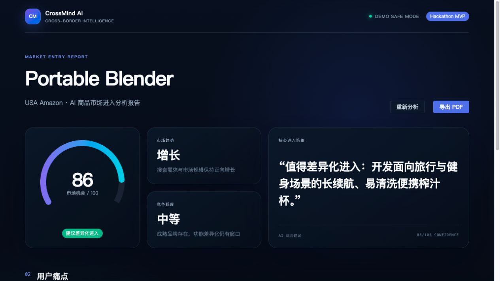

# CrossMind AI

> AI 跨境选品分析助手：让多个专业 Agent 协作完成市场趋势、竞品、用户反馈与进入策略分析。

CrossMind AI 面向跨境电商卖家。用户只需输入商品与目标市场，系统即可异步执行四个 AI Agent，并生成可导出 PDF 的《商品市场进入分析报告》。项目以黑客松演示为目标，具备完整用户流程、可观察的 Agent 执行过程和无需 API Key 的离线演示能力。

当前状态：**复赛 MVP 已完成，可本地/容器运行、调用赛事 Token Plan，并可录制完整 Demo。**

## 业务痛点

- 选品信息分散在趋势、竞品价格和评论中，人工整理耗时。
- 传统数据工具给出大量指标，却缺少可直接执行的产品与营销建议。
- 小团队难以同时完成市场研究、用户洞察和商业策略工作。
- 直接依赖在线模型或真实平台数据，会增加演示的不确定性和成本。

## 解决方案

CrossMind AI 将一次选品判断拆分为四个职责明确的 Agent：

1. **市场趋势 Agent**：判断市场趋势并给出机会分。
2. **竞品分析 Agent**：分析竞争程度、价格带和差异化空间。
3. **用户洞察 Agent**：从评论中提炼痛点与真实使用场景。
4. **商业策略 Agent**：综合前序结论，输出产品、定价和营销建议。

演示数据来自仓库内的 Mock 数据集，不抓取 Amazon，也不依赖外部数据源。没有配置百炼 API Key 时，系统自动使用 Mock 模型，保证现场演示稳定；配置后即可切换到阿里云百炼。

## 核心体验



示例输入：`Portable Blender` / `USA Amazon`。

## 系统架构



Controller 只处理 HTTP 请求；业务逻辑、Agent 编排和模型调用分别由 Service、Agent、LLM Client 层承担。更完整的设计见 [架构说明](docs/architecture.md)。

## 技术栈

| 层级 | 技术 |
| --- | --- |
| 前端 | Vue 3、Vite、Element Plus、Axios、ECharts |
| 后端 | Java 21、Spring Boot 3、Spring Web、Spring Data JPA |
| 数据 | PostgreSQL、Redis |
| AI | 可替换的 `LLMClient`、阿里云百炼、离线 Mock |
| 工程化 | Docker Compose、Maven、npm、GitHub Actions |

## 项目结构

```text
CrossMind-AI/
├── frontend/             # Vue 3 单页应用
├── backend/              # Spring Boot API 与 Agent 编排
├── docs/                 # 架构、演示与提交材料
├── mock-data/            # 可复现的演示商品数据
├── docker-compose.yml    # PostgreSQL 与 Redis
├── compose.deploy.yml    # 前后端 + 数据服务一键部署
├── Dockerfile            # 单容器交付 Web 与 API
└── README.md
```

## 快速启动

### 1. 环境要求

- Java 21
- Maven 3.9+
- Node.js 20.19+（推荐 Node.js 22）
- npm 10+
- Docker 与 Docker Compose

### 2. 启动基础服务

在项目根目录执行：

```bash
docker compose up -d
```

默认启动 PostgreSQL `5432` 和 Redis `6379`。如果端口被占用：

```bash
CROSSMIND_POSTGRES_PORT=15432 CROSSMIND_REDIS_PORT=16379 docker compose up -d
```

此时启动后端时需要使用对应端口：

```bash
cd backend
DB_URL=jdbc:postgresql://localhost:15432/crossmind REDIS_PORT=16379 mvn spring-boot:run
```

### 3. 启动后端

```bash
cd backend
mvn spring-boot:run
```

后端地址为 `http://localhost:8080`。访问 `http://localhost:8080/api/health` 检查服务状态。

如 8080 已被占用，可用 `SERVER_PORT=18080 mvn spring-boot:run` 切换端口。

### 4. 启动前端

新开一个终端：

```bash
cd frontend
npm ci
npm run dev
```

浏览器打开 `http://localhost:5173`。开发环境会将 `/api` 自动代理到后端。

如需同时切换前端端口和开发代理目标：

```bash
VITE_DEV_PORT=15173 VITE_DEV_API_TARGET=http://localhost:18080 npm run dev
```

## AI 模式

### 默认 Mock 模式

无需任何 API Key。系统读取 `mock-data/products.json`，并通过 `MockLLMClient` 生成稳定、可重复的 Agent 结果，适合开发和黑客松现场演示。

### 阿里云百炼模式

在启动后端前设置环境变量：

```bash
export DASHSCOPE_API_KEY='your-api-key'
export AI_PROVIDER='bailian'
export AI_MODEL='qwen3.7-plus'
export AI_BASE_URL='https://token-plan.cn-beijing.maas.aliyuncs.com/compatible-mode/v1'
mvn spring-boot:run
```

赛事 Token Plan 的 Key 必须和专属基地址配套使用。不要将真实 API Key 写入配置文件或提交到 GitHub。模型地址和超时可通过 `AI_BASE_URL`、`AI_CONNECT_TIMEOUT`、`AI_READ_TIMEOUT` 覆盖；设置 `AI_PROVIDER=mock` 可强制使用 Mock。页面右上角会显示当前是 `REAL AI` 还是安全演示模式，但不会返回或展示密钥。

## 一键容器部署

复制环境变量示例并按需填写；不填写 Key 时也能完整体验 Mock Agent 流程：

```bash
cp .env.example .env
docker compose -f compose.deploy.yml up -d --build
```

浏览器访问 `http://localhost:8080`。该部署会同时启动 Web/API、PostgreSQL 和 Redis，适合云服务器、演示机和评审环境。真实线上环境请修改数据库密码，并通过部署平台的 Secret 功能注入 API Key。

## API 示例

创建异步分析任务：

```bash
curl -X POST http://localhost:8080/api/analysis \
  -H 'Content-Type: application/json' \
  -d '{"product":"Portable Blender","market":"USA Amazon"}'
```

返回示例：

```json
{
  "analysisId": "e125ec37-72b2-487c-8983-67693f4b9344",
  "status": "RUNNING"
}
```

查询进度与报告：

```bash
curl http://localhost:8080/api/analysis/{analysisId}
```

## 测试与构建

```bash
cd backend
mvn test
```

```bash
cd frontend
npm ci
npm run build
```

GitHub Actions 会在推送和 Pull Request 时自动执行这两组检查。

## Demo 与截图

- [完整演示与录屏脚本](docs/demo.md)
- [系统架构说明](docs/architecture.md)
- [黑客松提交文案](docs/submission.md)
- [截图目录与拍摄清单](docs/screenshots/README.md)

录制真实运行流程后，将截图放到以下位置：

- `docs/screenshots/01-home.png`
- `docs/screenshots/02-agent-workflow.png`
- `docs/screenshots/03-analysis-report.png`

### 实际 Demo 截图







## 未来规划

- 接入真实且合规的市场趋势、广告与评论数据源。
- 增加 OpenAI、本地模型等 `LLMClient` 实现及模型路由。
- 将部分独立 Agent 并行化，并加入重试、超时和可观测性。
- 支持多商品对比、历史报告、团队协作和报告模板。
- 引入检索增强、引用溯源和人工反馈，提升结论可信度。
- 增加账号、权限、用量控制与生产级部署方案。

## 数据与安全说明

本 MVP 不采集真实 Amazon 数据，示例评论和竞品信息均为演示数据。仓库不应包含任何真实密钥、客户数据或平台凭证。当前报告仅用于选品辅助，不构成商业收益承诺。
