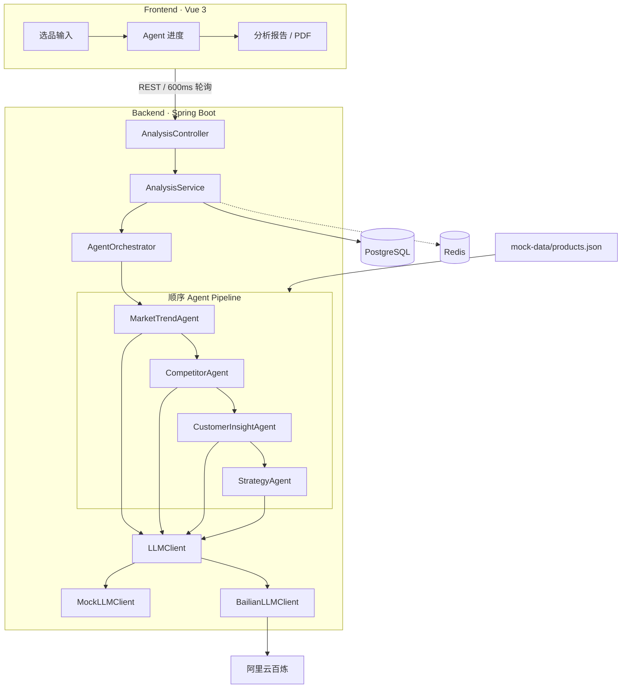
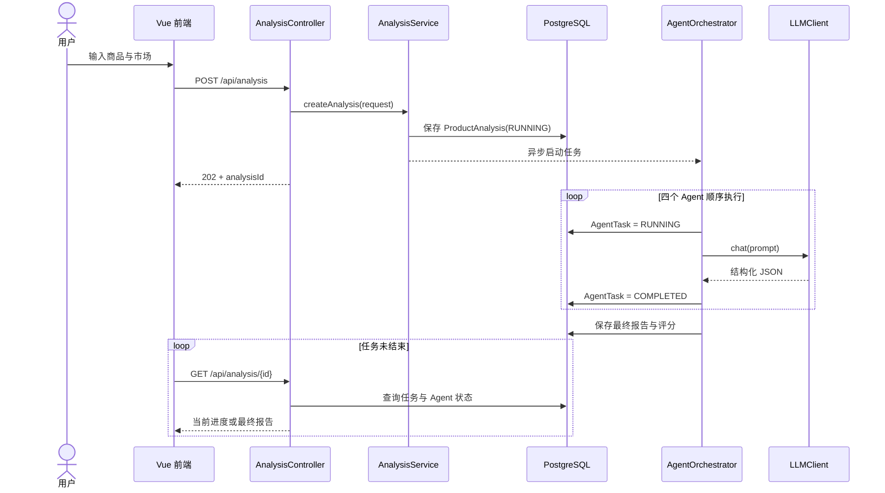
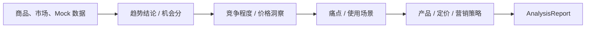

# CrossMind AI 系统架构

## 1. 架构目标

本项目优先保证黑客松演示所需的完整性、稳定性与可解释性：

- 用户能看到四个 Agent 的执行顺序和实时状态。
- 没有模型 Key 或外网时仍能跑通完整流程。
- AI 调用与 Web 接口解耦，后续可替换模型供应商。
- 任务、Agent 过程和最终报告均可追踪、可复现。

## 2. 总体架构

## 3. 请求与执行时序

创建接口快速返回 `202 Accepted`，实际分析在独立线程池中执行。前端轮询查询接口，因此可以逐步展示 Agent 状态，而不是等待一个长连接请求。

## 4. 后端职责边界

| 模块 | 主要职责 |
| --- | --- |
| `controller` | 请求校验、HTTP 状态与响应模型 |
| `service` | 分析任务生命周期、数据读取、LLM 端口与实现 |
| `agent` | 上下文传递、专业分析与四阶段编排 |
| `model` | JPA 实体、任务状态和 Agent 类型 |
| `repository` | PostgreSQL 数据访问 |
| `config` | AI 配置、条件装配与异步线程池 |
| `common` | DTO、错误模型与统一异常处理 |

AI 调用不会出现在 Controller 中。每个 Agent 只依赖 `LLMClient`，从而保持模型供应商与业务流程之间的边界。

## 5. Agent 数据流

每个 Agent 都返回结构化对象，并将 JSON 结果保存到 `agent_task`。`StrategyAgent` 读取完整上下文后输出最终报告，避免将整套分析退化为一次不可观察的大模型调用。

## 6. 数据模型

### `product_analysis`

| 字段 | 用途 |
| --- | --- |
| `id` | UUID 分析任务标识 |
| `product_name` | 商品名称 |
| `market` | 目标市场 |
| `status` | `RUNNING`、`COMPLETED` 或 `FAILED` |
| `score` | 最终市场机会评分 |
| `result_json` | 最终结构化报告 |
| `created_time` | 创建时间 |

### `agent_task`

| 字段 | 用途 |
| --- | --- |
| `id` | Agent 任务标识 |
| `analysis_id` | 关联的分析任务 |
| `agent_type` | 四类 Agent 之一 |
| `status` | 等待、执行、完成或失败状态 |
| `result` | 该 Agent 的结构化 JSON |
| `created_time` | 创建时间 |

## 7. 模型切换策略

Spring 根据 `ai.provider` 和 API Key 装配 `LLMClient`：

- 无 Key 或 `AI_PROVIDER=mock`：使用 `MockLLMClient`。
- `AI_PROVIDER=bailian` 且配置 `DASHSCOPE_API_KEY`：使用 `BailianLLMClient`。
- 未来模型：实现 `LLMClient#chat` 并增加对应条件装配即可。

Prompt 由各 Agent 管理，模型客户端只负责协议通信。这样可以独立演进提示词、模型与编排逻辑。

## 8. MVP 取舍

- 使用仓库内 Mock 数据，避免现场演示受第三方页面结构、限流或合规问题影响。
- 当前四个 Agent 顺序执行，便于展示推理链路，也保证 Strategy 能获取所有上游结果。
- 前端使用短轮询，部署简单；每个完成的 Agent 会立即返回独立结构化结果摘要，增强过程可解释性。生产环境可演进为 SSE 或 WebSocket。
- Redis 已纳入基础设施和配置边界，MVP 主任务状态以 PostgreSQL 为准；后续可用于热点报告缓存、分布式锁与任务队列。
- PDF 导出采用浏览器打印，满足 MVP 使用场景；后续可增加服务端模板和品牌化分页。
- 生产镜像将 Vue 静态资源与 Spring Boot API 合并为同源服务，并由 `compose.deploy.yml` 编排 PostgreSQL、Redis 与应用，减少评审部署步骤。

## 9. 生产化演进

后续重点包括数据源合规接入、Agent 并行与容错、结果引用溯源、模型路由与成本控制、身份权限、审计日志、指标监控以及容器化部署。
